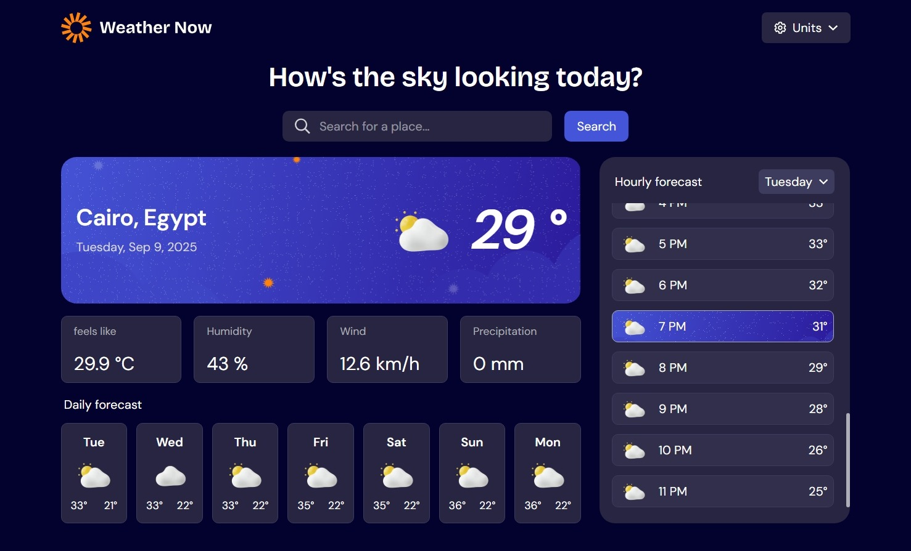

# Frontend Mentor - Weather app solution

This is a solution to the [Weather app challenge on Frontend Mentor](https://www.frontendmentor.io/challenges/weather-app-K1FhddVm49). Frontend Mentor challenges help you improve your coding skills by building realistic projects. 

## Table of contents

- [Overview](#overview)
  - [The challenge](#the-challenge)
  - [Screenshot](#screenshot)
  - [Links](#links)
- [My process](#my-process)
  - [Built with](#built-with)
  - [What I learned](#what-i-learned)
  - [Continued development](#continued-development)
  - [Useful resources](#useful-resources)
- [Author](#author)
- [Acknowledgments](#acknowledgments)

**Note: Delete this note and update the table of contents based on what sections you keep.**


## Overview


### The challenge

Users should be able to:


- Search and Select from different governorates in Egypt to view the weather.
- See the current weather conditions including temperature and weather icon.
- View the hourly forecast showing temperature changes throughout the day.
- Browse a 7-day forecast with daily high and low temperatures.

### Screenshot




### Links

- Solution URL: [Add solution URL here](https://github.com/MooYaseen/Weather_App)
- Live Site URL: [Add live site URL here](https://mooyaseen.github.io/Weather_App/)


## My process

### Built with

- [React](https://reactjs.org/) – JS library for building user interfaces  
- [Tailwind CSS](https://tailwindcss.com/) – Utility-first CSS framework  
- CSS Grid – For creating responsive layouts  
- Flexbox – For aligning and distributing elements  
- Desktop-first workflow


### What I learned

While working on this project, I learned several useful techniques and improved my React and Tailwind CSS skills.  

One of the things I’m proud of is how I handled filtering hourly data based on the selected day:  

```js
// To filter merged due to current-checked day
const getHourly = (arr, d) => {
  setHourlyDd(arr.filter((x, i) => i >= 24 * (d - 1) && i < 24 * d))
}
```

### Useful resources

- [TailwindCSS Documentation](https://tailwindcss.com/docs) - Helped me quickly style the project using utility classes and understand how to combine them effectively.  
- [React Documentation](https://react.dev) - Great reference for working with hooks like `useEffect`, `useRef`, and `useContext`.  


## Author

- Frontend Mentor – [@MooYaseen](https://www.frontendmentor.io/profile/MooYaseen)
- GitHub – [MooYaseen](https://github.com/MooYaseen)


## Acknowledgments

Thanks to [Frontend Mentor](https://www.frontendmentor.io/) for providing this challenge.  
It was a great way to practice React, Tailwind, and API integration in a real-world project. 
